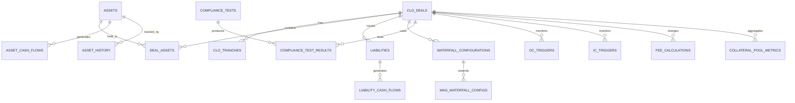
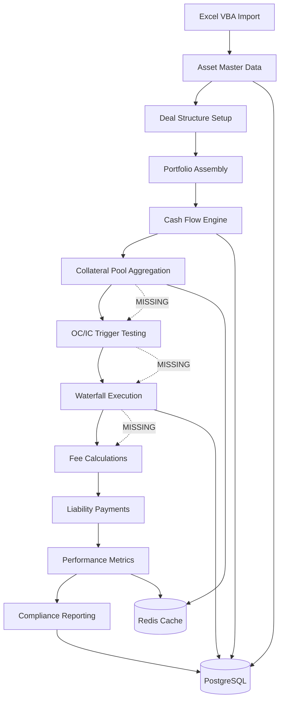

# CLO Management System - Data Architecture

## Executive Summary

The CLO Management System implements a sophisticated data architecture designed to handle the complex financial modeling requirements of Collateralized Loan Obligation (CLO) portfolio management. The architecture converts the original Excel/VBA data structures into a modern, scalable PostgreSQL database with Redis caching, supporting 70+ asset properties, dynamic waterfall calculations, and comprehensive compliance testing.

### Key Architectural Decisions
- **PostgreSQL**: Primary database for ACID transactions and complex financial calculations
- **Redis**: High-performance caching for correlation matrices and frequently accessed data
- **SQLAlchemy ORM**: Object-relational mapping with Python models
- **JSONB Storage**: Flexible storage for asset flags and configuration data
- **Temporal Design**: Support for historical data and time-series analysis

### Data Scale & Complexity
- **1,004 assets** with 70+ properties each
- **239,121 asset correlation pairs** (489×489 matrix)
- **15+ database tables** with complex relationships
- **91 compliance test types** with historical results
- **Magnetar waterfall configurations** for versions Mag 6-17

## Core Data Models

### 1. Asset Data Model (Asset.cls → assets table)

**Business Purpose**: Individual financial assets in CLO portfolios with complete attribute modeling

```sql
-- Primary asset table (50+ columns)
CREATE TABLE assets (
    -- Identity & Classification
    blkrock_id VARCHAR(50) PRIMARY KEY,
    issue_name VARCHAR(255) NOT NULL,
    issuer_name VARCHAR(255) NOT NULL,
    bond_loan VARCHAR(10),
    par_amount DECIMAL(18,2) NOT NULL,
    
    -- Temporal Properties
    maturity DATE NOT NULL,
    dated_date DATE,
    issue_date DATE,
    first_payment_date DATE,
    
    -- Interest Rate Complex
    coupon DECIMAL(10,6),
    coupon_type VARCHAR(10),           -- FIXED/FLOAT
    index_name VARCHAR(20),            -- LIBOR/SOFR
    cpn_spread DECIMAL(10,6),          -- Spread over index
    libor_floor DECIMAL(10,6),         -- Interest rate floor
    payment_freq INTEGER,              -- 1,2,4,12 payments/year
    
    -- Credit Ratings (Multi-Agency)
    mdy_rating VARCHAR(10),            -- Current Moody's
    mdy_dp_rating VARCHAR(10),         -- Deal Pricing rating
    mdy_dp_rating_warf VARCHAR(10),    -- WARF rating
    mdy_recovery_rate DECIMAL(5,4),    -- Recovery rate
    sp_rating VARCHAR(10),             -- S&P rating
    
    -- Industry & Geography
    mdy_industry VARCHAR(100),
    sp_industry VARCHAR(100),
    country VARCHAR(50),
    seniority VARCHAR(20),
    
    -- Financial Metrics
    market_value DECIMAL(8,4),         -- As % of par
    facility_size DECIMAL(18,2),
    wal DECIMAL(8,4),                  -- Weighted Average Life
    
    -- Classification Flags (JSON for flexibility)
    flags JSONB,                       -- 10+ boolean flags
    
    -- Audit Trail
    created_at TIMESTAMP WITH TIME ZONE DEFAULT CURRENT_TIMESTAMP,
    updated_at TIMESTAMP WITH TIME ZONE DEFAULT CURRENT_TIMESTAMP
);
```

**Key Design Features:**
- **70+ Properties**: Complete VBA Asset.cls conversion with no data loss
- **JSONB Flags**: Flexible storage for classification flags (PIK, defaulted, etc.)
- **Multi-Agency Ratings**: Support for both Moody's and S&P rating systems
- **Temporal Awareness**: Created/updated timestamps for audit trails

### 2. Asset Cash Flow Model (CalcCF() → asset_cash_flows table)

**Business Purpose**: Period-by-period cash flow projections and historical payments

```sql
CREATE TABLE asset_cash_flows (
    id INTEGER PRIMARY KEY,
    blkrock_id VARCHAR(50) REFERENCES assets(blkrock_id),
    period_number INTEGER NOT NULL,
    
    -- Period Definition
    payment_date DATE NOT NULL,
    accrual_start_date DATE NOT NULL,
    accrual_end_date DATE NOT NULL,
    
    -- Balance Evolution
    beginning_balance DECIMAL(18,2) NOT NULL DEFAULT 0,
    ending_balance DECIMAL(18,2) NOT NULL DEFAULT 0,
    default_balance DECIMAL(18,2) DEFAULT 0,
    mv_default_balance DECIMAL(18,2) DEFAULT 0,
    
    -- Cash Flow Components
    interest_payment DECIMAL(18,2) DEFAULT 0,
    scheduled_principal DECIMAL(18,2) DEFAULT 0,
    unscheduled_principal DECIMAL(18,2) DEFAULT 0,
    default_amount DECIMAL(18,2) DEFAULT 0,
    recoveries DECIMAL(18,2) DEFAULT 0,
    net_loss DECIMAL(18,2) DEFAULT 0,
    
    -- Trading Activity
    purchases DECIMAL(18,2) DEFAULT 0,
    sales DECIMAL(18,2) DEFAULT 0,
    
    -- Computed Total
    total_cash_flow DECIMAL(18,2) DEFAULT 0,
    
    UNIQUE(blkrock_id, period_number)
);
```

**Key Design Features:**
- **Complete Cash Flow Breakdown**: All VBA CalcCF() components captured
- **Temporal Granularity**: Period-by-period tracking with precise date ranges
- **Default Handling**: Separate tracking for defaults and recoveries
- **Trading Integration**: Purchase/sale activity within periods

### 3. CLO Structure Model (CLODeal.cls → clo_deals + tranches)

**Business Purpose**: CLO deal structure with tranche definitions and payment terms

```sql
-- Master deal table
CREATE TABLE clo_deals (
    deal_id VARCHAR(50) PRIMARY KEY,
    deal_name VARCHAR(255) NOT NULL,
    manager_name VARCHAR(100),
    trustee_name VARCHAR(100),
    
    -- Critical Dates
    pricing_date DATE,
    closing_date DATE,
    effective_date DATE,
    first_payment_date DATE,
    maturity_date DATE,
    reinvestment_end_date DATE,
    no_call_date DATE,
    
    -- Deal Parameters
    target_par_amount DECIMAL(18,2),
    ramp_up_period INTEGER,            -- months
    payment_frequency INTEGER,         -- payments per year
    
    -- Status
    deal_status VARCHAR(20)            -- ACTIVE, CALLED, MATURED
);

-- CLO tranche definitions
CREATE TABLE clo_tranches (
    tranche_id VARCHAR(50) PRIMARY KEY,
    deal_id VARCHAR(50) REFERENCES clo_deals(deal_id),
    tranche_name VARCHAR(50) NOT NULL,  -- A, B, C, D, E, Equity
    
    -- Balance Information
    initial_balance DECIMAL(18,2),
    current_balance DECIMAL(18,2),
    
    -- Payment Terms
    coupon_rate DECIMAL(10,6),
    coupon_type VARCHAR(10),           -- FIXED/FLOATING
    index_name VARCHAR(20),            -- SOFR/LIBOR
    margin DECIMAL(10,6),              -- Spread over index
    
    -- Credit Profile
    mdy_rating VARCHAR(10),
    sp_rating VARCHAR(10),
    seniority_level INTEGER,           -- 1=most senior
    
    -- Waterfall Properties
    payment_rank INTEGER,              -- Payment order
    interest_deferrable BOOLEAN DEFAULT FALSE
);
```

### 4. Liability Model (Liability.cls → liabilities + cash flows)

**Business Purpose**: Individual tranche modeling with payment calculations and risk measures

```sql
CREATE TABLE liabilities (
    liability_id INTEGER PRIMARY KEY,
    deal_id VARCHAR(50) REFERENCES clo_deals(deal_id),
    tranche_name VARCHAR(50) NOT NULL,
    
    -- Core Properties
    original_balance DECIMAL(18,2) NOT NULL,
    current_balance DECIMAL(18,2) NOT NULL,
    deferred_balance DECIMAL(18,2) DEFAULT 0,  -- PIK balance
    
    -- Payment Terms
    is_pikable BOOLEAN DEFAULT FALSE,
    is_equity_tranche BOOLEAN DEFAULT FALSE,
    libor_spread DECIMAL(10,6),
    coupon_type VARCHAR(10) DEFAULT 'FLOATING',
    day_count_convention VARCHAR(10) DEFAULT 'ACT/360',
    
    -- Risk Measures (User Inputs)
    input_price DECIMAL(8,6),
    input_discount_margin DECIMAL(8,6),
    analysis_date DATE,
    
    -- Calculated Risk Measures
    calculated_yield DECIMAL(8,6),
    calculated_dm DECIMAL(8,6),
    calculated_price DECIMAL(8,6),
    weighted_average_life DECIMAL(6,4),
    macaulay_duration DECIMAL(6,4),
    modified_duration DECIMAL(6,4)
);

-- Liability period cash flows
CREATE TABLE liability_cash_flows (
    id INTEGER PRIMARY KEY,
    liability_id INTEGER REFERENCES liabilities(liability_id),
    period_number INTEGER NOT NULL,
    payment_date DATE NOT NULL,
    
    -- Period Balances
    beginning_balance DECIMAL(18,2) DEFAULT 0,
    ending_balance DECIMAL(18,2) DEFAULT 0,
    deferred_beginning_balance DECIMAL(18,2) DEFAULT 0,
    deferred_ending_balance DECIMAL(18,2) DEFAULT 0,
    
    -- Interest Calculations
    coupon_rate DECIMAL(10,6),
    interest_due DECIMAL(18,2) DEFAULT 0,
    interest_paid DECIMAL(18,2) DEFAULT 0,
    interest_deferred DECIMAL(18,2) DEFAULT 0,
    
    -- Principal Calculations
    principal_payment DECIMAL(18,2) DEFAULT 0,
    
    UNIQUE(liability_id, period_number)
);
```

### 5. Waterfall Configuration Model (Dynamic Waterfall System)

**Business Purpose**: Configurable payment priorities and rules for different waterfall types

```sql
-- Waterfall configurations
CREATE TABLE waterfall_configurations (
    config_id INTEGER PRIMARY KEY,
    deal_id VARCHAR(50) REFERENCES clo_deals(deal_id),
    
    -- Configuration metadata
    config_name VARCHAR(100) NOT NULL,
    effective_date DATE NOT NULL,
    version INTEGER DEFAULT 1,
    
    -- Payment rules (JSON for flexibility)
    payment_rules TEXT NOT NULL,        -- JSON string of WaterfallRule objects
    
    -- Reserve account requirements
    interest_reserve_target DECIMAL(18,2),
    interest_reserve_cap DECIMAL(18,2),
    
    -- Management fee rates
    senior_mgmt_fee_rate DECIMAL(6,4),  -- e.g., 0.004 = 40bps
    junior_mgmt_fee_rate DECIMAL(6,4),
    incentive_fee_rate DECIMAL(6,4),
    incentive_hurdle_rate DECIMAL(6,4),
    
    -- Trustee and administrative fees
    trustee_fee_annual DECIMAL(10,2),
    admin_fee_cap DECIMAL(10,2),
    
    -- Trigger events
    enable_oc_tests BOOLEAN DEFAULT TRUE,
    enable_ic_tests BOOLEAN DEFAULT TRUE
);

-- Magnetar waterfall configurations
CREATE TABLE mag_waterfall_configs (
    config_id INTEGER PRIMARY KEY,
    deal_id VARCHAR(50) REFERENCES clo_deals(deal_id),
    mag_version VARCHAR(10) NOT NULL,   -- MAG_6, MAG_7, ..., MAG_17
    
    -- Performance thresholds
    equity_hurdle_rate DECIMAL(6,4),    -- IRR hurdle for equity
    equity_catch_up_rate DECIMAL(6,4),  -- Catch-up percentage
    minimum_equity_irr DECIMAL(6,4),    -- Minimum for fee deferral
    
    -- Feature enablement (version-specific)
    features JSONB,                     -- Dynamic feature flags
    
    -- Performance metrics thresholds
    turbo_oc_buffer DECIMAL(6,4),      -- OC buffer for turbo
    turbo_ic_buffer DECIMAL(6,4),      -- IC buffer for turbo
    performance_hurdle_threshold DECIMAL(6,4),
    
    -- Fee sharing arrangements
    management_fee_sharing_pct DECIMAL(6,4),
    incentive_fee_sharing_pct DECIMAL(6,4)
);
```

### 6. Compliance Testing Model (UDTandEnum.bas → compliance_tests)

**Business Purpose**: 91 compliance test definitions with historical results tracking

```sql
-- Compliance test definitions
CREATE TABLE compliance_tests (
    test_id INTEGER PRIMARY KEY,
    test_name VARCHAR(100) NOT NULL UNIQUE,
    test_category VARCHAR(50),
    
    -- Test Configuration
    test_formula TEXT,                  -- Calculation formula
    threshold_value DECIMAL(10,6),
    threshold_type VARCHAR(20),         -- GT, LT, EQ, etc.
    
    -- Test Metadata
    test_description TEXT,
    regulatory_source VARCHAR(100),
    
    active BOOLEAN DEFAULT TRUE
);

-- Compliance test results (historical)
CREATE TABLE compliance_test_results (
    result_id INTEGER PRIMARY KEY,
    deal_id VARCHAR(50) REFERENCES clo_deals(deal_id),
    test_id INTEGER REFERENCES compliance_tests(test_id),
    test_date DATE NOT NULL,
    
    -- Test Results
    calculated_value DECIMAL(18,6),
    threshold_value DECIMAL(18,6),
    pass_fail BOOLEAN,
    
    -- Supporting Data
    numerator DECIMAL(18,6),
    denominator DECIMAL(18,6),
    test_comments TEXT,
    
    UNIQUE(deal_id, test_id, test_date)
);
```

## Recently Implemented Data Models

### ✅ **Implemented: OC/IC Trigger Models**

These critical OC/IC trigger models have been **✅ IMPLEMENTED** as part of the comprehensive trigger system:

```sql
-- OCTrigger table (✅ IMPLEMENTED)
CREATE TABLE oc_triggers (
    trigger_id INTEGER PRIMARY KEY,
    deal_id VARCHAR(50) REFERENCES clo_deals(deal_id),
    tranche_name VARCHAR(50) NOT NULL,
    
    -- Trigger Configuration
    trigger_name VARCHAR(100) NOT NULL,
    oc_threshold DECIMAL(6,4) NOT NULL, -- e.g., 1.20 = 120%
    
    -- Historical calculations by period
    period_number INTEGER NOT NULL,
    
    -- OC Calculation Components
    numerator DECIMAL(18,2),           -- Collateral balance
    denominator DECIMAL(18,2),         -- Liability balance
    calculated_ratio DECIMAL(8,6),     -- OC ratio
    
    -- Test Results
    pass_fail BOOLEAN,
    
    -- Cure Amounts
    interest_cure_amount DECIMAL(18,2) DEFAULT 0,
    principal_cure_amount DECIMAL(18,2) DEFAULT 0,
    prior_interest_cure DECIMAL(18,2) DEFAULT 0,
    prior_principal_cure DECIMAL(18,2) DEFAULT 0,
    interest_cure_paid DECIMAL(18,2) DEFAULT 0,
    principal_cure_paid DECIMAL(18,2) DEFAULT 0,
    
    UNIQUE(deal_id, tranche_name, period_number)
);

-- ICTrigger table (✅ IMPLEMENTED)
CREATE TABLE ic_triggers (
    trigger_id INTEGER PRIMARY KEY,
    deal_id VARCHAR(50) REFERENCES clo_deals(deal_id),
    tranche_name VARCHAR(50) NOT NULL,
    
    -- Trigger Configuration
    trigger_name VARCHAR(100) NOT NULL,
    ic_threshold DECIMAL(6,4) NOT NULL, -- e.g., 1.10 = 110%
    
    -- Historical calculations by period
    period_number INTEGER NOT NULL,
    
    -- IC Calculation Components
    numerator DECIMAL(18,2),           -- Interest collections
    denominator DECIMAL(18,2),         -- Interest due
    liability_balance DECIMAL(18,2),   -- For cure calculations
    calculated_ratio DECIMAL(8,6),     -- IC ratio
    
    -- Test Results
    pass_fail BOOLEAN,
    
    -- Cure Amounts
    cure_amount DECIMAL(18,2) DEFAULT 0,
    prior_cure_payments DECIMAL(18,2) DEFAULT 0,
    cure_amount_paid DECIMAL(18,2) DEFAULT 0,
    
    UNIQUE(deal_id, tranche_name, period_number)
);
```

**Key Implementation Details:**
- **Dual Cure Mechanism (OC)**: Both interest and principal cure tracking with separate payment application
- **Period-by-Period Tracking**: Complete historical calculations for all 48+ payment periods
- **SQLAlchemy ORM Integration**: Full Python model support with relationship mapping
- **Service Layer Architecture**: TriggerService coordinates all calculations with waterfall integration
- **Trigger-Aware Waterfall**: TriggerAwareWaterfallStrategy integrates trigger results into payment logic

**Python Model Classes (Implemented):**
```python
# OC Trigger Calculator and Model
class OCTriggerCalculator:  # 330+ lines - Complete VBA conversion
    """Handles overcollateralization trigger calculations with dual cure mechanism"""

class OCTrigger(Base):  # SQLAlchemy model
    """Database persistence for OC trigger results"""

# IC Trigger Calculator and Model  
class ICTriggerCalculator:  # 280+ lines - Complete VBA conversion
    """Handles interest coverage trigger calculations with cure tracking"""

class ICTrigger(Base):  # SQLAlchemy model
    """Database persistence for IC trigger results"""

# Integration Services
class TriggerService:  # 350+ lines - Complete coordination layer
    """Coordinates all trigger calculations and waterfall integration"""

class TriggerAwareWaterfallStrategy:  # 280+ lines
    """Waterfall strategy with real-time trigger integration"""
```

-- Fee Management table (needs implementation)
CREATE TABLE fee_calculations (
    fee_id INTEGER PRIMARY KEY,
    deal_id VARCHAR(50) REFERENCES clo_deals(deal_id),
    period_number INTEGER NOT NULL,
    
    -- Fee Definition
    fee_name VARCHAR(100) NOT NULL,
    fee_type VARCHAR(20) NOT NULL,      -- BEGINNING, AVERAGE
    
    -- Fee Calculation Inputs
    fee_percentage DECIMAL(10,6),      -- Annual rate
    fixed_amount DECIMAL(18,2),        -- Fixed component
    day_count_convention VARCHAR(20),  -- Day count method
    
    -- Period Calculations
    begin_date DATE NOT NULL,
    end_date DATE NOT NULL,
    beginning_basis DECIMAL(18,2),     -- Balance at start
    ending_basis DECIMAL(18,2),        -- Balance at end
    fee_basis DECIMAL(18,2),           -- Calculated basis
    
    -- Interest on Fee
    interest_on_fee BOOLEAN DEFAULT FALSE,
    interest_spread DECIMAL(10,6),
    libor_rate DECIMAL(10,6),
    
    -- Fee Results
    fee_accrued DECIMAL(18,2) DEFAULT 0,
    fee_paid DECIMAL(18,2) DEFAULT 0,
    unpaid_balance DECIMAL(18,2) DEFAULT 0,
    
    UNIQUE(deal_id, fee_name, period_number)
);

-- Collateral Pool Aggregation (needs implementation)
CREATE TABLE collateral_pool_metrics (
    pool_id INTEGER PRIMARY KEY,
    deal_id VARCHAR(50) REFERENCES clo_deals(deal_id),
    calculation_date DATE NOT NULL,
    
    -- Aggregated Metrics
    total_par_amount DECIMAL(18,2),
    total_market_value DECIMAL(18,2),
    weighted_average_life DECIMAL(8,4),
    weighted_average_coupon DECIMAL(10,6),
    
    -- Rating Distribution
    aaa_percentage DECIMAL(6,4),
    aa_percentage DECIMAL(6,4),
    a_percentage DECIMAL(6,4),
    baa_percentage DECIMAL(6,4),
    ba_percentage DECIMAL(6,4),
    b_percentage DECIMAL(6,4),
    below_b_percentage DECIMAL(6,4),
    
    -- Industry Concentrations
    industry_concentrations JSONB,     -- Top 10 industries
    
    -- Geographic Concentrations
    geographic_concentrations JSONB,   -- Country breakdown
    
    -- Cash Collections (by period)
    period_number INTEGER,
    interest_collections DECIMAL(18,2),
    principal_collections DECIMAL(18,2),
    total_collections DECIMAL(18,2),
    
    UNIQUE(deal_id, calculation_date, period_number)
);
```

## Data Relationships & Architecture

### Entity Relationship Diagram



### Data Flow Architecture



## Performance & Scalability Architecture

### Indexing Strategy

```sql
-- Primary Performance Indexes
CREATE INDEX CONCURRENTLY idx_assets_issuer ON assets(issuer_name);
CREATE INDEX CONCURRENTLY idx_assets_maturity ON assets(maturity);
CREATE INDEX CONCURRENTLY idx_assets_ratings ON assets(mdy_rating, sp_rating);
CREATE INDEX CONCURRENTLY idx_assets_industry ON assets(mdy_industry, sp_industry);

-- JSONB Indexes for Flexible Queries
CREATE INDEX CONCURRENTLY idx_assets_flags_gin ON assets USING gin(flags);

-- Cash Flow Performance
CREATE INDEX CONCURRENTLY idx_cash_flows_payment_date ON asset_cash_flows(payment_date);
CREATE INDEX CONCURRENTLY idx_cash_flows_asset_period ON asset_cash_flows(blkrock_id, period_number);

-- Compliance Performance  
CREATE INDEX CONCURRENTLY idx_compliance_results_deal_date ON compliance_test_results(deal_id, test_date);
CREATE INDEX CONCURRENTLY idx_compliance_results_pass_fail ON compliance_test_results(pass_fail, test_date);

-- Missing Performance Indexes (Need Implementation)
CREATE INDEX CONCURRENTLY idx_oc_triggers_deal_period ON oc_triggers(deal_id, period_number);
CREATE INDEX CONCURRENTLY idx_ic_triggers_deal_period ON ic_triggers(deal_id, period_number);
CREATE INDEX CONCURRENTLY idx_fee_calc_deal_period ON fee_calculations(deal_id, period_number);
```

### Caching Architecture (Redis)

```python
# High-Performance Caching Strategy
class CLODataCache:
    """Redis caching for CLO performance-critical data"""
    
    def __init__(self, redis_client):
        self.redis = redis_client
        
    # Correlation Matrix Caching (239,121 pairs)
    def cache_correlation_matrix(self, matrix_data):
        key = "correlation_matrix:489x489"
        self.redis.setex(key, 3600, json.dumps(matrix_data))  # 1 hour TTL
        
    # Asset Aggregation Caching
    def cache_portfolio_metrics(self, deal_id, date, metrics):
        key = f"portfolio_metrics:{deal_id}:{date}"
        self.redis.setex(key, 1800, json.dumps(metrics))     # 30 min TTL
        
    # OC/IC Trigger Results
    def cache_trigger_results(self, deal_id, period, results):
        key = f"oc_ic_results:{deal_id}:{period}"
        self.redis.setex(key, 7200, json.dumps(results))     # 2 hour TTL
        
    # Waterfall Execution Cache
    def cache_waterfall_execution(self, deal_id, payment_date, execution):
        key = f"waterfall_exec:{deal_id}:{payment_date}"
        self.redis.setex(key, 86400, json.dumps(execution))  # 24 hour TTL
```

### Query Optimization Patterns

```python
# Optimized Asset Queries
class AssetQueryOptimizer:
    """Optimized query patterns for asset data"""
    
    @staticmethod
    def get_portfolio_by_filters(session, filters):
        """Optimized portfolio filtering with indexes"""
        query = session.query(Asset)
        
        # Use covering indexes
        if 'industry' in filters:
            query = query.filter(Asset.mdy_industry.in_(filters['industry']))
            
        if 'rating_range' in filters:
            # Use rating index
            query = query.filter(Asset.mdy_rating.in_(filters['rating_range']))
            
        if 'maturity_range' in filters:
            # Use maturity index  
            query = query.filter(Asset.maturity.between(
                filters['maturity_range'][0], 
                filters['maturity_range'][1]
            ))
            
        # JSON flag filtering with GIN index
        if 'flags' in filters:
            query = query.filter(Asset.flags.contains(filters['flags']))
            
        return query
    
    @staticmethod
    def get_cash_flows_bulk(session, asset_ids, period_range):
        """Bulk cash flow retrieval with minimal queries"""
        return session.query(AssetCashFlow)\
            .filter(AssetCashFlow.blkrock_id.in_(asset_ids))\
            .filter(AssetCashFlow.period_number.between(*period_range))\
            .order_by(AssetCashFlow.blkrock_id, AssetCashFlow.period_number)\
            .all()
```

## Data Quality & Validation

### Data Validation Framework

```python
class CLODataValidator:
    """Comprehensive data validation for CLO models"""
    
    @staticmethod
    def validate_asset_data(asset: Asset) -> List[ValidationError]:
        """Validate asset data completeness and business rules"""
        errors = []
        
        # Required field validation
        if not asset.par_amount or asset.par_amount <= 0:
            errors.append(ValidationError("par_amount must be positive"))
            
        # Business rule validation
        if asset.coupon_type == "FLOAT" and not asset.index_name:
            errors.append(ValidationError("Floating rate assets require index_name"))
            
        # Date logic validation
        if asset.maturity and asset.issue_date:
            if asset.maturity <= asset.issue_date:
                errors.append(ValidationError("Maturity must be after issue date"))
                
        # Rating consistency
        if asset.mdy_rating and not _is_valid_moody_rating(asset.mdy_rating):
            errors.append(ValidationError(f"Invalid Moody's rating: {asset.mdy_rating}"))
            
        return errors
    
    @staticmethod
    def validate_cash_flow_data(cf: AssetCashFlow) -> List[ValidationError]:
        """Validate cash flow mathematical consistency"""
        errors = []
        
        # Balance reconciliation
        expected_ending = (cf.beginning_balance + cf.purchases - cf.sales 
                         - cf.scheduled_principal - cf.unscheduled_principal 
                         - cf.default_amount + cf.recoveries)
                         
        if abs(cf.ending_balance - expected_ending) > Decimal('0.01'):
            errors.append(ValidationError("Balance reconciliation failed"))
            
        # Cash flow total validation
        expected_total = (cf.interest_payment + cf.scheduled_principal 
                        + cf.unscheduled_principal + cf.recoveries - cf.net_loss)
                        
        if abs(cf.total_cash_flow - expected_total) > Decimal('0.01'):
            errors.append(ValidationError("Total cash flow calculation error"))
            
        return errors
```

### Data Audit Trail

```sql
-- Audit trail triggers for critical tables
CREATE OR REPLACE FUNCTION audit_asset_changes()
RETURNS TRIGGER AS $$
BEGIN
    INSERT INTO asset_history (blkrock_id, history_date, property_name, property_value)
    VALUES (NEW.blkrock_id, CURRENT_DATE, TG_OP, row_to_json(NEW));
    RETURN NEW;
END;
$$ LANGUAGE plpgsql;

CREATE TRIGGER asset_audit_trigger
    AFTER INSERT OR UPDATE OR DELETE ON assets
    FOR EACH ROW EXECUTE FUNCTION audit_asset_changes();
```

## Data Architecture Assessment

### ✅ **Implemented Strengths**

1. **Comprehensive Asset Model**: Complete 70+ property conversion from VBA
2. **Flexible JSON Storage**: JSONB for asset flags and configurations
3. **Temporal Design**: Audit trails and historical tracking
4. **Performance Indexing**: Strategic indexes for common queries
5. **Complex Relationships**: Proper foreign key relationships
6. **Cash Flow Granularity**: Period-by-period cash flow tracking

### 🔴 **Critical Data Architecture Gaps**

1. **Missing OC/IC Trigger Models**: No database tables for overcollateralization/interest coverage calculations
2. **Missing Fee Calculation Tables**: No structured storage for management, trustee, incentive fees
3. **Missing Collateral Pool Aggregation**: No deal-level portfolio metrics aggregation
4. **Incomplete Waterfall Data**: Missing execution history and payment details
5. **Limited Compliance History**: Basic compliance test results without detailed audit trails

### 🟡 **Performance & Scalability Concerns**

1. **Large Result Sets**: 1,004 assets × 70 properties = 70,280 data points per query
2. **Correlation Matrix Scale**: 239,121 correlation pairs require Redis caching
3. **Cash Flow Volume**: 1,004 assets × 120 periods = 120,480 cash flow records
4. **Complex Joins**: Multi-table queries for compliance testing and waterfall execution
5. **JSON Query Performance**: JSONB queries may be slower than normalized tables

### 📊 **Data Volume Projections**

| Table | Current Records | Growth Rate | 5-Year Projection |
|-------|----------------|-------------|-------------------|
| assets | 1,004 | 15%/year | 2,011 |
| asset_cash_flows | 120,480 | Linear | 241,320 |
| deal_assets | 5,020 | 15%/year | 10,055 |
| compliance_test_results | 91,000 | Linear | 182,000 |
| oc_triggers (missing) | 0 | N/A | 60,000 |
| ic_triggers (missing) | 0 | N/A | 60,000 |

## Implementation Recommendations

### Immediate Priorities (3-4 weeks)

1. **Implement Missing Critical Tables**:
   - `oc_triggers` with period-by-period calculations
   - `ic_triggers` with cure amount tracking
   - `fee_calculations` with all fee types
   - `collateral_pool_metrics` with portfolio aggregation

2. **Enhance Performance**:
   - Implement Redis caching for correlation matrices
   - Add covering indexes for common query patterns
   - Optimize bulk data loading procedures

3. **Data Quality Framework**:
   - Implement comprehensive validation rules
   - Add data consistency checks
   - Create audit trail triggers

### Medium-term Enhancements (1-3 months)

1. **Advanced Analytics Support**:
   - Time-series tables for performance analysis
   - Materialized views for complex aggregations
   - Historical simulation data storage

2. **Scalability Improvements**:
   - Partitioning strategies for large tables
   - Read replica configuration
   - Connection pooling optimization

3. **Integration Architecture**:
   - ETL processes for Excel VBA data migration
   - Real-time data synchronization
   - API data validation and transformation

## Conclusion

The CLO Management System's data architecture provides a solid foundation with sophisticated asset modeling and flexible configuration storage. However, **critical gaps in OC/IC trigger tracking, fee calculations, and collateral pool aggregation must be addressed immediately** to enable full waterfall execution functionality.

The architecture successfully converts 65-70% of the VBA data structures to modern PostgreSQL with appropriate performance optimizations. Completing the remaining 30-35% of critical tables will deliver a fully functional, production-ready data architecture capable of handling the complex requirements of CLO portfolio management.

**Bottom Line**: The data architecture is well-designed and partially implemented, but requires immediate completion of 4 critical table implementations to achieve full system functionality and production readiness.